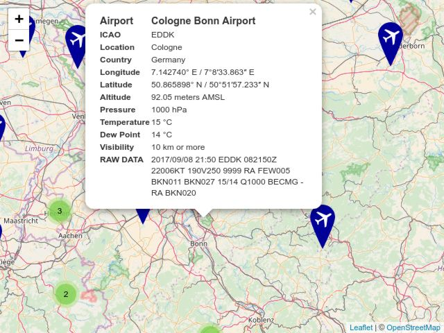

# airportWeather

Map to get METAR information for airports by clicking on them.

This project is in the prototype stage. It already has basic functionality but it's not yet for the masses :)

Currently there are:

* several node scripts that fetch data to be used and convert it into JSON
* a node script that puts the data together to generate the geoJSON
* a map that uses leaflet to display the airports

To create the web page that links the METAR data

1. clone this project (favourably using `git clone`)
1. change into the project's directory
1. install all required packages using `npm install`
1. issue `npm run publish` 

These steps will obtain all the packages and data needed (a couple of MB), process the data and generate a subdirectory
named `website` containing a website displaying all the airports for which a location is available and for which
the availability of METAR information has been confirmed (said METAR information may however be outdated).

Due to browser security settings you will not be able to open the website using a `file://` url, it needs to be
served by a web server. This web server needs to PHP support because accessing
(tgftp.nws.noaa.gov)[http://tgftp.nws.noaa.gov] qualifies as cross site scripting and hence requires a. The one I use
is written in PHP because that's the language supported by most hosters.

Anyway: Clicking on one of the markers opens a popup that currently shows the raw METAR data. Note that the popup may
need a moment to show up as live data is fetched.

`package.json` contains a number of tasks that allow you to only update what really needs to be updated - see the
following diagram: The task names are verbose to make it obvious what the individual tasks are good for.

    publish
       ├── setup
       │      ├── fetchData
       │      │      ├── getAirportList
       │      │      │      ├── getAirportListFromOpenFlights
       │      │      │      └── getAirportListFromOurAirports
       │      │      └── getAdditionalData
       │      │             ├── getCountries
       │      │             └── getIcaoWithMetarAvailable
       │      └── processData
       └── makeWebsite
    
# Licenses

* for licenses of packages used see the corresponding `node_modules` subdirectories
* for the proxy see [PROXY_LICENSE.txt](PROXY_LICENSE.txt) - the proxy I use is [PHP CORS Proxy](https://github.com/softius/php-cross-domain-proxy) by [Iacovos Constantinou](https://github.com/softius)
* for the project's code see [LICENSE.txt](LICENSE.txt)